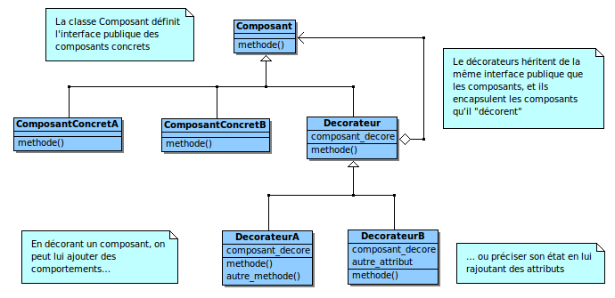

# Python decorators

##### **Introduction:**

The main role of [decorators]([Les décorateurs python](https://python.doctor/page-decorateurs-decorator-python-cours-debutants) is to modify the behavior of functions. They are useful when wanting to add the same code to several existing functions.

Decorators are nothing more or less than functions to modify the behavior of other functions and/or to execute additional code.

Thus, rather than stupidly copying and pasting code in order to slightly modify the behavior of a function, Python offers you to avoid code repetition, thus reducing code maintenance problems via the possibility of creating functions from higher order.


Decorators are considered, in Python, as a fairly advanced concept. The ability to pass as a parameter, to a function, to another function, does not necessarily seem automatic or natural in procedural or object programming.

However, this is what the decorators will allow us to do: via a function, manipulate other functions (both in input and output) and possibly impact their behavior. To do this, simply pass the name of the function to be handled (without the “()”) like any other parameter.

On the application side, this can be very useful for having intelligent code that can adapt to various environments, generate code execution logs, etc.

##### Presentation of the concept :


Here is a simplified example of a decorator. In the code below, we call our decoration function “decorator()” by passing it a function as argument: my_function(). Compared to the function alone (Editor's note: my_function), we execute additional code and therefore modify the behavior of the function. We are therefore in the presence of a decorator.

In fact, we are not changing the behavior of the function code in any way, since we are not touching it. It is at the level of the function call that everything is played and it will be the final result that will be impacted.

However, this has the disadvantage that you have to call the decorator and not the function each time you need this extra functionality.

Python makes it possible to simplify this writing via a syntax dedicated to decorators, which is declared with the "@".

```python
1.

def decorator(fonction):
    print('appelle de la fonction')

    return fonction()

def ma_fonction():
    print("hello_world")

decorator(ma_fonction)

................................
appelle de la fonction

hello_world

2.
def mon_decorateur(fonction):
    print('appelle de la fonction')

    return fonction

@mon_decorateur
def ma_fonction():
    print("hello_world")

ma_fonction()

................................
appelle de la fonction
```

In this case, we see that we are calling our function as if it were undecorated. Python takes care, transparently for us, to substitute its decorated version

A question then perhaps comes to mind: what if we don't want to decorate the function? just pass through a variable

And There you go. If a_decorer is True, then our decorator will play its part. But if a_decorer is False, then we get our standard function back. To switch from a debug version that requires the function call log to a distribution version, you just need to change this value.

This is what the basic operation of a decorator is based on.

```python
series of decorators : Syntax

mon_decorateur01(mon_decorateur02(ma_fonction))

or

@mon_decorateur01
@mon_decorateur02
ma_fonction():
...
```

##### **Theory:**

The decorators give the possibility of modification of the functions defined to extend their functionalities or to change the behavior of this one. They impose a law on a defined function without modifying its content and without modifying the content of the libraries on which they are used.



```python
Definition of decorator
language = True
def decorator(func):
    if language:
        print("Bonjour le monde !")
    return func

@decorator
def hello():
 print("hello world !")

Bonjour le monde
```

##### Pratical example :

Let's take the case which is such that the user to modify a line in a database must be connected to do so, he must have authorization for this purpose.

---

###### First exemple:

```python
user_status = True

def decorator_connection(function):
    def connection():
        if user_status:
            return function()
        else:
            print("vous n'êtes pas connecté")
    return connection
```

 For user_status = True

```python
@decorator_connection
def profile():
    print("le profile utilisateur")

profile()
--------------------------------------
le profile utilisateur
```

For user_status = False

```python
@decorator_connection
def articles():
    print("accès aux articles")

articles()
----------------------------------------
vous n'êtes pas connecté
```

###### Second exemple : decorators with parameters

```python
admin = "diakite"
def user_admin(username):
    def decorator(function):
        def traitment():
            if admin == username:
                return function ()
            else: 
                print("you haven't the permission")
        return traitment
    return decorator


@user_admin("diakite")
def connection():
    print("vous êtes connecté en tant que administrateur")

connection()
------------------------------------------------------
vous êtes connecté en tant que administrateur
------------------------------------------------------
But we change the username in our fonction like this :

 @user_admin("Nsukami")
def connection():
    print("vous êtes connecté en tant que administrateur")
connection()
------------------------------------------------------
you haven't the permission
```

These lines demonstrate that decorators are [callable](https://www.geeksforgeeks.org/callable-in-python/) which take as argument, the function to decorate and return a callable, decorators add a layer of logic to a function with an explicit @decorator syntax.

##### **Potential alternatives** :

A very popular way to use decorators in Python is as a time recorder. This helps a programmer know the time it takes to execute a function to measure efficiency.

**Remembering** is another cool way to use decorators in Python. The results of repeated function calls without any changes can be easily remembered for later calculations. You can simply memorize a function with decorators.

Built-in Python decorators like `@classmethod`(class method), `@staticmethod`(static method) and `@property` are very popular in Python's OOP decorator pattern

##### **Concrete use cases related to data analysis** :

The [dtype_decorate](https://morioh.com/p/e84595a0001c) is a module defines two different decorators at the current state. These decorators can be used to constrain the attributes of the decorated function to specific data types. This can help to keep functions clean especially when they are written for a specific context. This is usually the case for scientific applications, where functionality is often more important than clean code

###### **Usage**

There are two decorators so far: accept and enforce. accept will restrict the attribute data types to the the defined ones, while enforce will try to convert the given attribute to a desired data type. Both can also be used together, where accept does only make sense to be used after enforce.

Define a function that does only accept an int and a float.

```python
---------------pip install dtype-decorate-------------------
import ddec
@ddec.accept(a=int, b=float)
def f(a, b):
  pass
```

```python
@ddec.accept(a=(int, float))
def f(a, be_any_type)
  pass

f(5, 'mystr')   # will run fine
f('mystr', 5)   # will raise a TypeError
```

```python
@ddec.accept(a='None', b=('None', 'callable'))
def f(a, b):
  pass

f(None, None)           # will run fine
f(None, lambda x: x)    # will run fine
f(5, None)              # will raise a TypeError
```

##### Conclusion :

As we have just seen, decorators are among the Python concepts that can quickly turn out to be very useful.

Widely used by seasoned Python developers, decorators make it possible to obtain concise code, limiting repetitions to the strict minimum, without sacrificing significant readability.

I hope that this introduction will have convinced you, and will allow you in the future to be even more efficient with Python.

finally the list of consulted resources.

##### Resources consulted :

[decorators]([Les décorateurs python](https://python.doctor/page-decorateurs-decorator-python-cours-debutants)

[callable](https://www.geeksforgeeks.org/callable-in-python/)

[dtype_decorate](https://morioh.com/p/e84595a0001c)

[Les décorateurs python](https://python.doctor/page-decorateurs-decorator-python-cours-debutants)
