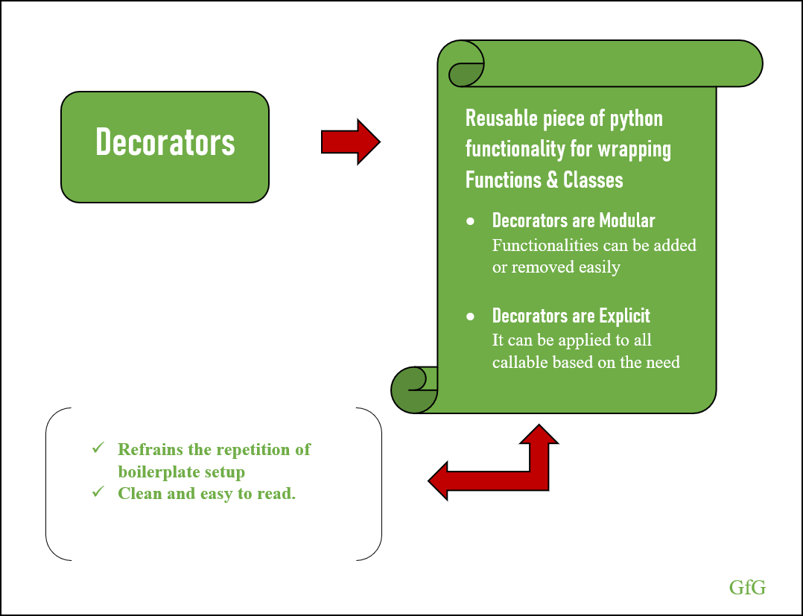

# Python decorators

##### **Introduction:**

The main role of [decorators]([Les décorateurs python](https://python.doctor/page-decorateurs-decorator-python-cours-debutants) is to modify the behavior of functions. They are useful when wanting to add the same code to several existing functions.

Les décorateurs ne sont ni plus ni moins que des fonctions permettant de modifier le comportement d'autres fonctions et/ou d'exécuter du code supplémentaire.

Ainsi, plutôt que de copier/coller bêtement du code afin de légèrement modifier le comportement d'une fonction, Python vous propose d'éviter la répétition de code, réduisant ainsi les problèmes de maintenance du code via la possibilité de créer des fonctions d'ordre supérieur.



Les décorateurs sont considérés, en Python, comme une notion assez évoluée. La possibilité de passer en paramètre, à une fonction, une autre fonction, ne semble en effet pas forcément automatique ou naturelle en programmation procédurale ou objet.

Cependant, c'est ce que les décorateurs vont nous permettre de faire : via une fonction, manipuler d'autres fonctions (aussi bien en entrée qu'en sortie) et éventuellement impacter leur comportement. Pour ce faire, il suffira de passer le nom de la fonction à manipuler (sans les « () » ) comme n'importe quel autre paramètre.

Côté application, cela peut être fort utile pour avoir du code intelligent sachant s'adapter à divers environnements, générer des logs de l'exécution du code…

##### Présentation du concept :

Voici un exemple simplifié de décorateur. Dans le code ci-dessus, nous appelons notre fonction de décoration « mon_decorateur() » en lui passant en argument une fonction : ma_fonction(). Par rapport à la fonction seule (NDLR : ma_fonction), nous exécutons du code supplémentaire et par conséquent, modifions le comportement de la fonction. Nous sommes donc bien en présence d'un décorateur.

En réalité, nous ne modifions nullement le comportement du code de la fonction, puisque nous n'y touchons pas. C'est au niveau de l'appel de la fonction que tout se joue et ce sera le résultat final qui sera impacté.

Cependant cela a l'inconvénient que vous deviez appeler le décorateur et non pas la fonction à chaque fois que vous avez besoin de cette fonctionnalité supplémentaire.

Python permet de simplifier cette écriture via une syntaxe dédiée aux décorateurs, que l'on déclare avec le « @ ».

```python
1.

def decorator(fonction):
    print('appelle de la fonction')

    return fonction()

def ma_fonction():
    print("hello_world")

decorator(ma_fonction)

................................
appelle de la fonction

hello_world

2.
def mon_decorateur(fonction):
    print('appelle de la fonction')

    return fonction

@mon_decorateur
def ma_fonction():
    print("hello_world")

ma_fonction()

................................
appelle de la fonction
```

Dans ce cas, nous voyons que nous appelons notre fonction comme si elle n'était pas décorée. Python se charge, de façon transparente pour nous, de lui substituer sa version décorée

Une question vous vient alors peut-être à l'esprit : et si on ne désire pas décorer notre fonction ? Eh bien il suffit de passer par une variable

Et voilà. Si a_decorer vaut True, alors notre décorateur jouera son rôle. Mais si a_decorer vaut False, alors nous récupérons notre fonction standard. Pour passer d'une version de débogage qui requiert le log des appels de fonction à une version de distribution, il vous suffira de changer cette valeur.

C'est sur cela que repose le fonctionnement de base d'un décorateur

```python
enchainement des décorateurs : Syntaxe

mon_decorateur01(mon_decorateur02(ma_fonction))

or

@mon_decorateur01
@mon_decorateur02
ma_fonction():
...
```

##### **Théorie:**

Les décorateurs donne la possibilité de modification des fonctions définis pour étendre leurs fonctionnalités ou changer le comportement de celle-ci. Il imposent une loi sur une fonction définie sans modifier son contenu et dans sans modifier le contenu des bibliothèques sur lesquelles il sont utilisés.

```python
Definition du décorateur
language = True
def decorator(func):
    if language:
        print("Bonjour le monde !")
    return func

@decorator
def hello():
 print("hello world !")

Bonjour le monde
```

##### Exemple pratique :

Prénons le cas qui est tel que, l'utilisateur pour modifier une ligne dans une base de données doit se connecté pour le faire il faut avoir une autorisation à cet effet.

---

###### Firs exemple:

```python
user_status = True

def decorator_connection(function):
    def connection():
        if user_status:
            return function()
        else:
            print("vous n'êtes pas connecté")
    return connection
```

 For user_status = True

```python
@decorator_connection
def profile():
    print("le profile utilisateur")

profile()
--------------------------------------
le profile utilisateur
```

For user_status = False

```python
@decorator_connection
def articles():
    print("accès aux articles")

articles()
----------------------------------------
vous n'êtes pas connecté
```

###### Second exemple : decorators with parameters

```python
admin = "diakite"
def user_admin(username):
    def decorator(function):
        def traitment():
            if admin == username:
                return function ()
            else: 
                print("you haven't the permission")
        return traitment
    return decorator
    

@user_admin("diakite")
def connection():
    print("vous êtes connecté en tant que administrateur")
    
connection()
------------------------------------------------------
vous êtes connecté en tant que administrateur
```

Ces lignes demontrent que les decorateurs sont des [callable](https://www.geeksforgeeks.org/callable-in-python/)  qui prennent comme argument, la fonction à décorer et retourne un callable, les décorateurs ajoute une couche de logique à une fonction avec une syntaxe explicite @decorateur.

##### Potentielles alternatives

Une façon très populaire d'utiliser les décorateurs en Python est comme un enregistreur de temps. Cela aide un programmeur à connaître le temps nécessaire à l'exécution d'une fonction pour mesurer l'efficacité.

**La mémorisation** est une autre façon intéressante d'utiliser les décorateurs en Python. Les résultats des appels de fonction répétés sans aucun changement peuvent être facilement mémorisés lors de calculs ultérieurs. Vous pouvez simplement mémoriser une fonction avec des décorateurs.

Les décorateurs Python intégrés comme `@classmethod`(méthode de classe), `@staticmethod`(méthode statique) et `@property`sont très populaires dans le modèle de décorateur POO de Python


##### Des cas d’utilisation concrets en rapport avec l’analyse de données

[**DType-Decorate**]([Mini-Library for Data-Type Check and Conversion Decorators (morioh.com)

The DType-Decorate is a module defines two different decorators at the current state. These decorators can be used to constrain the attributes of the decorated function to specific data types. This can help to keep functions clean especially when they are written for a specific context. This is usually the case for scientific applications, where functionality is often more important than clean code

###### **Usage**

There are two decorators so far: accept and enforce. accept will restrict the attribute data types to the the defined ones, while enforce will try to convert the given attribute to a desired data type. Both can also be used together, where accept does only make sense to be used after enforce.

Define a function that does only accept an int and a float.

```python
---------------pip install dtype-decorate-------------------
import ddec
@ddec.accept(a=int, b=float)
def f(a, b):
  pass
```

```python
@ddec.accept(a=(int, float))
def f(a, be_any_type)
  pass

f(5, 'mystr')   # will run fine
f('mystr', 5)   # will raise a TypeError
```

```python
@ddec.accept(a='None', b=('None', 'callable'))
def f(a, b):
  pass

f(None, None)           # will run fine
f(None, lambda x: x)    # will run fine
f(5, None)              # will raise a TypeError
```

#### Conclusion

Comme nous venons de le voir, les décorateurs font partie des concepts Python qui peuvent rapidement se révéler fort utiles.

Très utilisés par les développeurs Python aguerris, les décorateurs permettent d'obtenir du code concis, limitant les répétitions au strict minimum, sans pour autant renoncer à une lisibilité importante.

J'espère que cette introduction aura su vous convaincre, et vous permettra à l'avenir d'être encore plus performant avec Python.

enfin la liste des ressources consultées.
